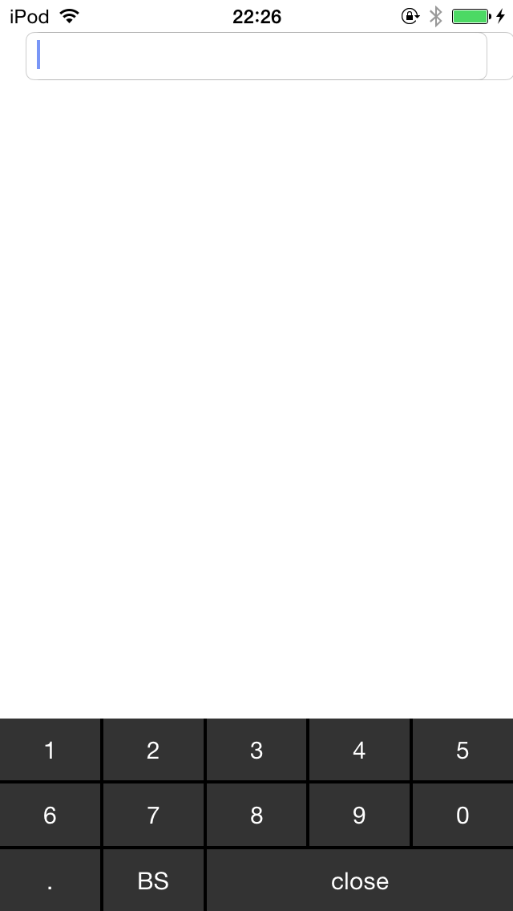

IPAddressKeyboard
==================

IPAddress keyboard is a library to display a keyboard that specializes in the input of the only IP Address for UITextField / UITextView.


This project is under the Apache License 2.0

# USAGE #
----------

```swift
let ipkeyboard = IPAddressKeyboard()
ipkeyboard.activeTextField = ipTextField
ipTextField.inputView = ipkeyboard
```

