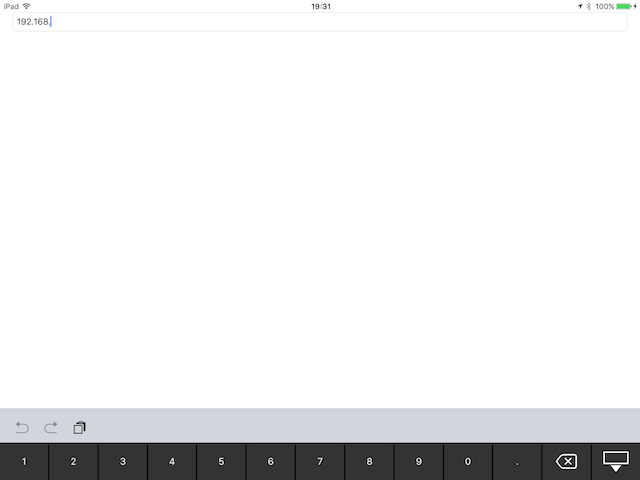

IPAddressKeyboard
==================
IPAddress keyboard is a library to display a keyboard that specializes in the input of the only IP Address for UITextField / UITextView.
  


  
# USAGE #
----------
```swift
let ipkeyboard = IPAddressKeyboard()
ipkeyboard.activeTextField = ipTextField
ipTextField.inputView = ipkeyboard
```

# Credits #
----------
IPAddress keyboard was written by M.Toshima.

# License #
----------
This project is under the Apache License 2.0

