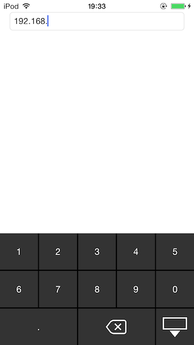

# IPAddressKeyboard
==================
IPAddress keyboard is a library to display a keyboard that specializes in the input of the only IP Address for UITextField / UITextView.
  
[](https://travis-ci.org/戸嶋誠/IPAddressKeyboard)
[](http://cocoapods.org/pods/IPAddressKeyboard)
[](http://cocoapods.org/pods/IPAddressKeyboard)
[](http://cocoapods.org/pods/IPAddressKeyboard)




## Example

To run the example project, clone the repo, and run `pod install` from the Example directory first.

## Installation

IPAddressKeyboard is available through [CocoaPods](http://cocoapods.org). To install
it, simply add the following line to your Podfile:

```ruby
pod "IPAddressKeyboard"
```
# USAGE #
----------
```swift
let ipkeyboard = IPAddressKeyboard()
ipkeyboard.activeTextField = ipTextField
ipTextField.inputView = ipkeyboard
```

## Author
----------

IPAddress keyboard was written by M.Toshima.

## License
----------
IPAddressKeyboard is available under the Apache License 2.0. See the LICENSE file for more info.
